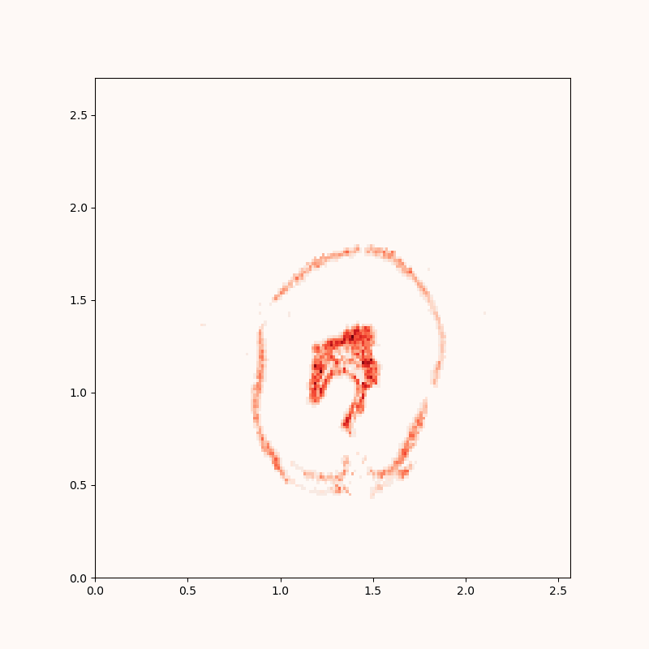
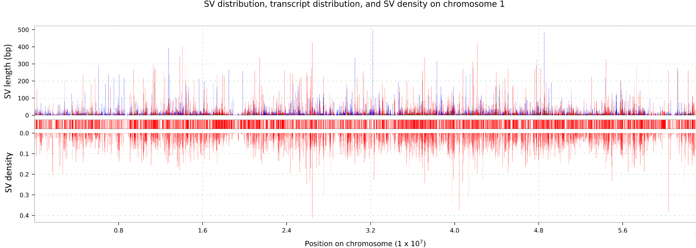

This repository contains some of the most substantial Python notebooks I created in my PhD research and used to produce many of the figures found in my thesis. 

**MRE_candidate_gene_discovery_example.ipynb** was used to discover candidate genes that are potentially regulated via the Metal Responsive Element in the genome of *Lumbricus rubellus* (the 18 chromosomes from NCBI accession: GCA_945859625.1).The script requires a FASTA file with your sequence of interest, and the gene prediction data (gtf file) for that sequence. The output of this code is the Suplementary Table 2; Figures 43-49 were produced using elements of the code found in this script.

The **Tetranucleotide_count_rough_workbook.ipynb** script was used to count 4-mers in the genome assembly of the earthworm from Cwmystwyth in attempt to remove contaminating reads/contigs. Script requires only the FASTA file with sequences of interest (reads or contigs). This notebook was not tidied up to preserve the figure output for display. Figure 23 was created using this script.

The **Whole_chromosome_variant_analysis_example.ipynb** script was used to merge the long-read genome assembly (PacBio), gene prediction (FINDER), variant calling (DeepVariant), and annotation (UPIMAPI) datasets, produce statistics from the combined data, and allow visualisation of key loci on chromosomes of *Lumbricus rubellus* genomes via a Myriapoda plot (example image below). This script served as the cornerstone in production of Figures 34-36, 38-42, 45, 46 and the majority of the statistical tables in Chapter 3 of my thesis.
 
 

